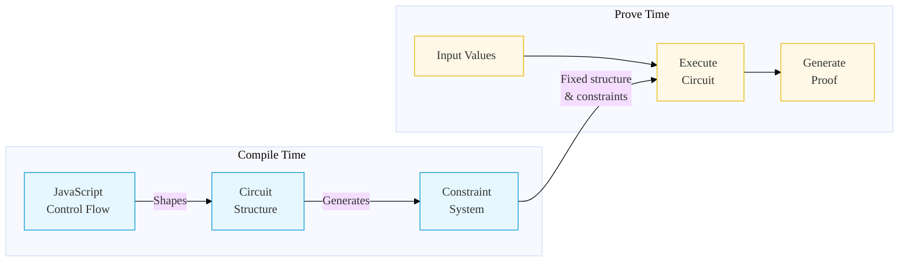

import CodeBlock from '@theme/CodeBlock';

## Introduction

Welcome to this walkthrough of implementing HMAC-SHA256 in o1js! This tutorial will guide you through creating a zero-knowledge circuit (ZkProgram) that implements the HMAC-SHA256 algorithm, a widely used cryptographic hash-based message authentication code.

### What You'll Learn

- Implementing HMAC-SHA256 in a zero-knowledge circuit using o1js
- Working with provable arrays and bit manipulation in ZkPrograms
- Using cryptographic gadgets like SHA256 in o1js
- Applying metaprogramming patterns to shape circuit structure - using static control flow to shape circuit structure
- Best practices for writing complex zero-knowledge circuits

### Prerequisites

Before starting this tutorial, make sure you:
- Have basic knowledge of cryptography concepts
- Are familiar with o1js basics and ZkPrograms
- Understand how hash functions work

:::tip New to o1js?
If you're just getting started, check out the [o1js basics](../getting-started/intro.mdx) first.
:::

## Understanding HMAC

### What is HMAC?

HMAC (Hash-based Message Authentication Code) is a specific type of message authentication code that combines:
- A cryptographic hash function
- A secret key

It provides a way to verify both:
- Data integrity (message hasn't been modified)
- Message authenticity (sender is verified)

:::info Historical Note
The HMAC construction was first published in 1996 by Mihir Bellare, Ran Canetti, and Hugo Krawczyk. It has since become a fundamental building block in standards like TLS, JWT, and many others.
:::

### Why Use HMAC?

1. **Message Integrity**: Ensures the message hasn't been tampered with
2. **Authentication**: Verifies the sender's identity through the shared secret key
3. **Non-repudiation**: The sender cannot deny sending the message (when combined with other cryptographic primitives)

For learning more about HMAC, feel free to read the resources below:

### Why HMAC-SHA256 Specifically? 

HMAC-SHA256 uses SHA-256 as its underlying hash function. It's widely used because:
- SHA-256 is cryptographically secure
- The 256-bit output size provides strong security against collision attacks
- It's relatively fast to compute
- It's widely supported across different platforms and languages


## HMAC-SHA256: Under the Hood

### The Algorithm

The HMAC algorithm can be expressed as:

```
HMAC(k,m) = H((k_0 ^ opad) || H((k_0 ^ ipad) || m))
```

Where:
| Symbol | Meaning |
|--------|---------|
| k | Secret key |
| m | Message to authenticate |
| H | Hash function (SHA-256) |
| k_0 | Derived key (padded/hashed key) |
| opad | Outer padding (0x5c repeated) |
| ipad | Inner padding (0x36 repeated) |
| \|\| | Concatenation |
| ^ | XOR operation |

:::note Block Size
Since we're using SHA-256 as our hash function, the block size is 64 bytes (512 bits). This is a property of SHA-256's internal block processing. The key `k` is processed into `k_0` based on its length:
- If key length < 64 bytes: Padded with zeros to 64 bytes
- If key length = 64 bytes: Used as-is without modification
- If key length > 64 bytes: Hashed using SHA-256 (producing 32 bytes) and then padded with zeros to 64 bytes
:::

### The Process Step by Step

1. **Key Preparation** 🔑
   ```mermaid
   graph LR
   A[Input Key] --> B{Key Length?}
   B -->|> 64 bytes| C[Hash Key] --> D[Pad with Zeros] --> E[k_0]
   B -->|= 64 bytes| E
   B -->|< 64 bytes| D
   ```

2. **Inner Hash** 🔄
   ```mermaid
   graph LR
   A[k_0] --> B[XOR with ipad]
   B --> C[Concatenate Message]
   C --> D[SHA-256]
   ```

3. **Outer Hash** 🔄
   ```mermaid
   graph LR
   A[k_0] --> B[XOR with opad]
   B --> C[Concatenate Inner Hash]
   C --> D[SHA-256]
   ```

## Interactive Example

Let's walk through a real HMAC-SHA256 calculation. You can follow along using these online tools:
- [ASCII to Hex Converter](https://www.rapidtables.com/convert/number/ascii-to-hex.html)
- [XOR Calculator](https://toolslick.com/math/bitwise/xor-calculator)
- [SHA-256 Calculator](https://emn178.github.io/online-tools/sha256.html)

### Our Input Values

```text
const key = "key123";              // Our secret key
const message = "Hello, World!";    // Message to authenticate
```

### Step-by-Step Calculation

<details>
<summary>1️⃣ Convert Inputs to Hex</summary>

```text
// Key in hex
"key123" → 6B6579313233

// Message in hex
"Hello, World!" → 48656C6C6F2C20576F726C6421
```
</details>

<details>
<summary>2️⃣ Prepare the Key</summary>

```text
// Original key (6 bytes)
6B6579313233

// Padded to 64 bytes
6B657931323300000000000000000000
00000000000000000000000000000000
00000000000000000000000000000000
00000000000000000000000000000000
```
</details>

<details>
<summary>3️⃣ Create Padding Values</summary>

```text
// ipad - 0x36 repeated 64 times
36363636363636363636363636363636
36363636363636363636363636363636
36363636363636363636363636363636
36363636363636363636363636363636

// opad - 0x5C repeated 64 times
5C5C5C5C5C5C5C5C5C5C5C5C5C5C5C5C
5C5C5C5C5C5C5C5C5C5C5C5C5C5C5C5C
5C5C5C5C5C5C5C5C5C5C5C5C5C5C5C5C
5C5C5C5C5C5C5C5C5C5C5C5C5C5C5C5C
```
</details>

<details>
<summary>4️⃣ Calculate Inner Hash</summary>

```text
// 1. XOR key with ipad
k_0 ^ ipad = 5D534F0704053636363636363636363636363636363636363636363636363636363636363636363636363636363636363636363636363636363636363636363636

// 2. Concatenate with message
(k_0 ^ ipad) || m =  5D534F0704053636363636363636363636363636363636363636363636363636363636363636363636363636363636363636363636363636363636363636363648656C6C6F2C20576F726C6421

// 3. SHA-256 result
H((k_0 ^ ipad) || m) = 9d9c48d074304040cb5efa94008a719d95773a778cae5ff52fae84f89fa7dd45
```
</details>

<details>
<summary>5️⃣ Calculate Outer Hash</summary>

```text
// 1. XOR key with opad
k_0 ^ opad = 3739256D6E6F5C5C5C5C5C5C5C5C5C5C5C5C5C5C5C5C5C5C5C5C5C5C5C5C5C5C5C5C5C5C5C5C5C5C5C5C5C5C5C5C5C5C5C5C5C5C5C5C5C5C5C5C5C5C5C5C5C5C

// 2. Concatenate with inner hash
(k_0 ^ opad) || H((k_0 ^ ipad) || m) = 3739256D6E6F5C5C5C5C5C5C5C5C5C5C5C5C5C5C5C5C5C5C5C5C5C5C5C5C5C5C5C5C5C5C5C5C5C5C5C5C5C5C5C5C5C5C5C5C5C5C5C5C5C5C5C5C5C5C5C5C5C5C9d9c48d074304040cb5efa94008a719d95773a778cae5ff52fae84f89fa7dd45

// 3. Final HMAC-SHA256
H((k_0 ^ opad) || H((k_0 ^ ipad) || m)) = 81c362d8cfc25d551d72d86cc700e6d5574191d49dc55dd500086840e34563b8
```
</details>

:::tip Verify Your Result
You can verify this result using the [HMAC Calculator](https://cryptotools.net/hmac):
- Algorithm: SHA-256
- Key: key123
- Message: Hello, World!
:::

In the next section, we'll implement this exact computation in o1js, making it provable using o1js!

## Making HMAC-SHA256 Provable

In this section, we'll implement HMAC-SHA256 as a zero-knowledge circuit using o1js. Understanding the fundamental constraints and behaviors of zero-knowledge circuits is crucial for this implementation.

### 1. Circuit Design Fundamentals

#### Circuit-Compatible Types

Every value in a circuit must be provable in zero-knowledge. o1js provides specific types for this:

```typescript
// Fundamental circuit types
const field = new Field(123);     // Finite field element (base type for all circuit values)
const bool = new Bool(true);      // Boolean values in circuits
const uint8 = new UInt8(255);     // 8-bit unsigned integer (0 to 255)
const uint32 = new UInt32(1000);  // 32-bit unsigned integer
const uint64 = new UInt64(1000n); // 64-bit unsigned integer (note: use 'n' suffix for BigInt)

// CORRECT: Fixed size known at compile time
const fixedArray = Provable.Array(Field, 16).empty();

// WRONG: Dynamic size - will fail
let dynamicArray = [];
array.push(new Field(1)); // Error: Dynamic operations not allowed

```

:::note Circuit Values
All circuit values must be:
- Representable as field elements
- Known size (number of field elements is fixed)

These properties are implemented by:
```typescript
sizeInFields(): number {
  return sizeInFields(typeData);
},
toFields(value: T): Field[] {
  return toFields(typeData, value);
},
```
:::

### 2. Circuit Control Flow

#### Compile-Time vs Prove-Time
Understanding when code executes is crucial. Let's examine how JavaScript control flow shapes our circuit:



**Example: HMAC Key Preparation**
```ts file=../snippets/hmac-sha256/hmac-sha256.ts start=start_keyprep end=end_keyprep
```
**Impact on Circuit Constraints:**

| Key Length | Message Length | Circuit Structure | Total Constraints |
|------------|---------------|-------------------|------------------|
| 4 bytes    | 28 bytes      | Padding only      | 21,214          |
| 20 bytes   | 8 bytes       | Padding only      | 21,136          |
| 131 bytes  | 54 bytes      | SHA-256 + padding | 37,228          |
| 131 bytes  | 152 bytes     | SHA-256 + padding | 47,859          |


1. **Compile-Time Decisions:**
   - Key length check happens at compile time
   - Circuit structure is determined based on these checks
   - Different constraints are generated for each path

2. **Constraint Generation:**
   - Short keys (< 64 bytes): Only padding constraints (~21,000)
   - Long keys (> 64 bytes): SHA-256 + padding constraints (~37,000-48,000)
   - Each path generates a different number of constraints

3. **Performance Implications:**
   - More constraints = longer proving time
   - Circuit structure is optimized for the specific input size
   - No runtime overhead for unused paths

In contrast, `Provable.if` runs during proving. Both paths are always included in the circuit
```typescript
const result = Provable.if(condition, value1, value2);
```

**Understanding `Provable.if`**

`Provable.if` is fundamentally different from regular if statements:

```typescript
// 1. Basic value selection
const x = Provable.if(
  value.equals(0),    // Condition must be Bool
  Field(1),          // Value if true
  Field(2)           // Value if false
);
// - Both Field(1) and Field(2) are evaluated
// - Constraints ensure x equals the correct value
// - No actual branching occurs


// 2. Computed values
const a = Field(5);
const b = Field(3);
const max = Provable.if(
  a.greaterThan(b),  // Condition: is a > b?
  a,                 // If true: max = a
  b                  // If false: max = b
);
// - Both paths compute their values
// - Circuit includes constraints for both paths
// - Result selection is also constrained


// 3. Multiple conditions with switch
const value = Provable.switch(
  [
    condition1,     // First condition
    condition2,     // Second condition
    Bool(true)      // Default case
  ],
  Field,           // Return type
  [
    Field(1),      // Value if condition1 is true
    Field(2),      // Value if condition2 is true
    Field(3)       // Default value
  ]
);
// - All values are computed
// - Exactly one condition must be true
// - Result is constrained based on conditions
```

:::warning Important `Provable.if` Rules
1. Conditions must be `Bool` type
2. Both paths are always evaluated
3. Return values must be the same type
4. No side effects allowed (must return values)
5. All values must be circuit-compatible
:::

### 3. HMAC Implementation Details

#### Working with Provable Arrays

```ts file=../snippets/hmac-sha256/hmac-sha256.ts start=start_provable_arrays end=end_provable_arrays
```

#### Bit Manipulation and Word Operations

```ts file=../snippets/hmac-sha256/hmac-sha256.ts start=start_bit_ops end=end_bit_ops
```

:::warning Important Considerations
1. **Type Safety**
   - Always use circuit-compatible types (`UInt8`, `UInt32`, etc.)
   - Check bounds when performing operations
   - Handle overflows explicitly
   - Be mindful of byte order in word operations

2. **Memory Management**
   - Arrays must have fixed sizes known at compile time
   - Use appropriate array methods that work in circuits
   - Consider constraint count when choosing operations

3. **Performance**
   - Bit operations generate constraints
   - Complex operations can be expensive
   - Reuse computed values when possible

4. **Common Pitfalls**
   - Avoid dynamic array operations
   - Don't assume regular JavaScript array methods work
   - Be careful with type conversions
   - Watch out for byte order when converting between types
:::

#### Gadgets

Gadgets in o1js are reusable building blocks that provide optimized implementations of common operations. In HMAC-SHA256, we primarily use the `SHA2_256` hash gadget:

```typescript
import { Hash } from 'o1js';

// Using SHA2_256 for key hashing
const hashedKey = Hash.SHA2_256.hash(key);

// Using SHA2_256 for inner and outer hashes
const innerHash = Hash.SHA2_256.hash(innerBlock);
const finalHash = Hash.SHA2_256.hash(outerBlock);
```

While `SHA2_256` is the main gadget we use in HMAC, o1js provides other useful gadgets for circuit operations:

```typescript
// Bitwise operations
const xorResult = Gadgets.xor(value1, value2, 64);  // XOR two 64-byte values
const andResult = Gadgets.and(value1, value2);      // Bitwise AND

// Range checks
Gadgets.rangeCheck8(byteValue);     // Check if value is in [0, 255]
Gadgets.rangeCheck32(wordValue);    // Check if value is in [0, 2^32-1]

// Word operations (32-bit)
const rotated = Gadgets.rotate32(word, 7, 'right');  // Rotate bits right
const shifted = Gadgets.rightShift32(word, 3);       // Shift bits right
```

:::note
Choose gadgets based on:
- Efficiency (use specialized gadgets over manual implementations)
- Constraint count (each gadget operation adds constraints)
- Safety (use appropriate range checks and validation)
:::


### 4. Complete Implementation

Here's our complete implementation:

```ts file=../snippets/hmac-sha256/hmac-sha256.ts
```

### Using the Implementation

With o1js, you can compose HMAC proofs with other zero-knowledge circuits. Here's how to integrate it into your ZkProgram:

```ts file=../snippets/hmac-sha256/run.ts
```

In the next section, we'll explore how to test this implementation thoroughly.

## Writing Tests for Provable HMAC-SHA256
/* TODO */

## Conclusion
You can check more advanced examples like eddsa-o1js or feel free to find other examples from awesome-o1js