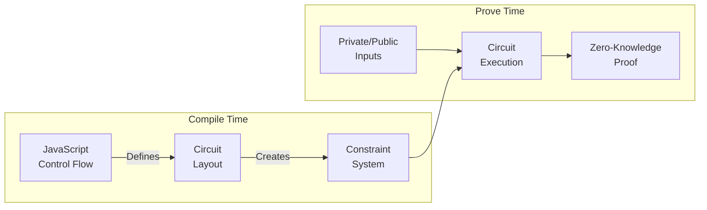

import CodeBlock from '@theme/CodeBlock';

## Overview

In traditional programming, we use `if` statements to control program flow by evaluating conditions and branching to different code paths. However, zero-knowledge circuits work differently - they must follow the exact same path every time they execute. This fundamental difference requires us to think about conditional logic in a different way.

## How Circuits Handle Control Flow



## The Two Phases of Circuits

### 1. Compile Time (Circuit Generation)

During compile time, regular JavaScript code runs to shape your circuit:
- Regular JavaScript `if/else` statements and loops are allowed
- The circuit structure is being determined
- You can optimize based on known parameters
- The final structure becomes fixed before proving begins

#### Example: HMAC Key Preparation at Compile Time

Here's a real-world example from the HMAC implementation that uses compile-time conditions to optimize the circuit:

```ts file=../snippets/hmac-sha256/hmac-sha256.ts start=start_keyprep end=end_keyprep
```

This example demonstrates how compile-time conditions affect circuit structure:

| Key Length | Message Length | Circuit Structure | Total Constraints |
|------------|---------------|-------------------|------------------|
| 4 bytes    | 28 bytes      | Padding only      | 21,214          |
| 20 bytes   | 8 bytes       | Padding only      | 21,136          |
| 131 bytes  | 54 bytes      | SHA-256 + padding | 37,228          |
| 131 bytes  | 152 bytes     | SHA-256 + padding | 47,859          |

The JavaScript `if` statements run at compile time to determine:
1. Whether to include SHA-256 hashing constraints (for long keys)
2. Whether to include padding constraints (for short keys)
3. The final circuit structure and constraint count


### 2. Prove Time (Circuit Execution)

During prove time, the circuit executes with actual values:
- Circuit structure is fixed
- All paths must be evaluated
- No dynamic branching is possible
- Conditional logic must use special constructs


#### Example: Value Selection Pattern

Instead of using traditional if/else statements, we use value selection at prove time:

```ts file=../snippets/conditional-logic/conditional-logic.ts start=start_valid_execution end=end_valid_execution
```

This works because we're selecting a value rather than trying to execute different code paths. The result is determined by the condition, but both paths are still evaluated.

#### Example: Using Functions

You can use functions in conditional paths if they follow these rules:
- Must return the same type for all paths
- No side effects allowed
- Must be deterministic

Here's an example:

```ts file=../snippets/conditional-logic/conditional-logic.ts start=start_2_valid_execution_with_function end=end_2_valid_execution_with_function
```

#### Common Pitfall: Side Effects

Here's an example of conditional logic that won't work at prove time:

```ts file=../snippets/conditional-logic/conditional-logic.ts start=start_invalid_execution end=end_invalid_execution
```

The problem: Both paths are always evaluated, so the counter would always increment by the same amount. Side effects in conditional paths will not work as expected because both paths are always executed.

## Summary

When writing conditional logic in o1js:
- Use JavaScript if/else for compile-time circuit optimization
- Use `Provable.if` for runtime value selection
- Avoid side effects in conditional paths
- Remember that both paths are always evaluated
- Keep functions pure and deterministic
